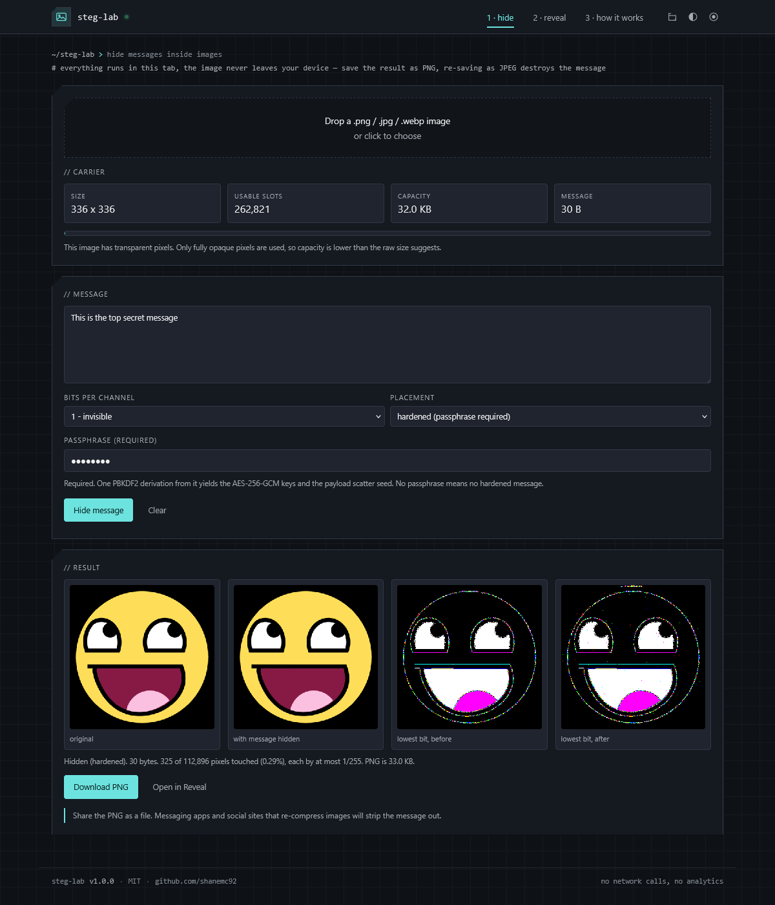
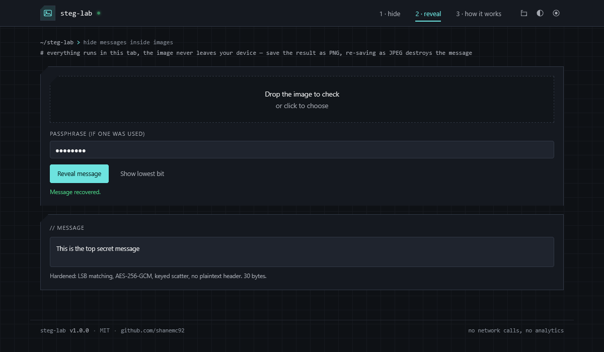
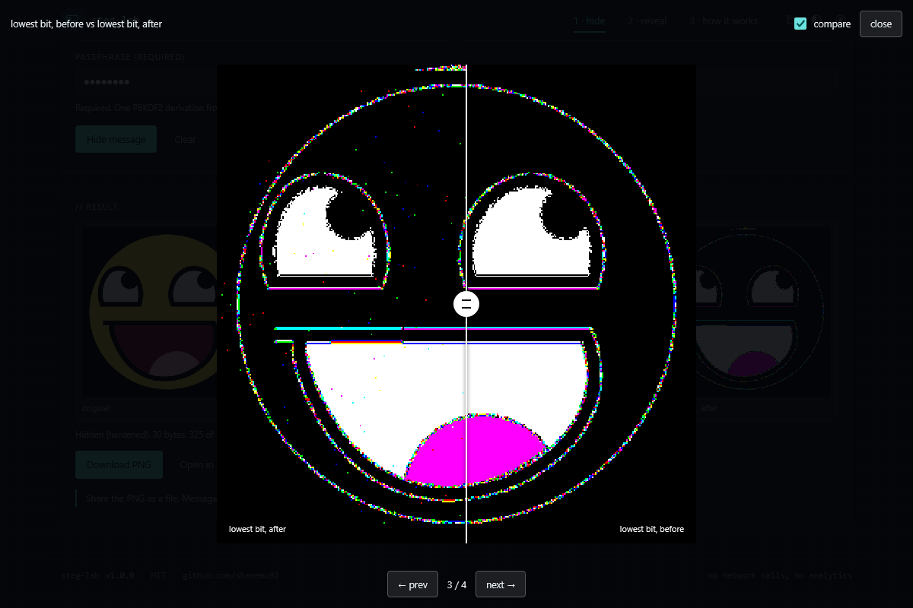

# steg-lab

A single-file, client-side tool for learning how steganography actually works. Hide a message in the pixels of an image, share the PNG, pull the message back out. Nothing is uploaded and there are no network calls - the whole thing is one HTML file.

Built as a teaching tool. It shows you the bit planes, the capacity maths and the ways hidden messages get caught, rather than just handing you an image and saying "done".



## Features

- **LSB embedding** at 1, 2 or 3 bits per colour channel, with live capacity calculation as you type
- **Five placement modes** - sequential, centered, scattered, hardened, and robust (see below)
- **Hardened mode** - LSB matching instead of replacement, keyed scatter placement, and no plaintext header; without the passphrase there is no signature to find and a wrong passphrase is indistinguishable from an image with nothing hidden
- **Centered mode** - fills outward from the centre rather than from the top-left, so the message survives edge overwrites (caption bars, logos, letterboxing) that keep the image dimensions unchanged
- **Robust mode** - survives lossy recompression and uniform resizing by embedding in a per-cell sinusoidal pattern rather than individual pixel bits; capacity scales from a few bytes on a small image to ~125 on a 12MP one
- **AES-GCM encryption** (PBKDF2-SHA256, 150k iterations) applied before embedding when a passphrase is set; mandatory in hardened mode with two independent 256-bit keys
- **Bit-plane viewer** showing the lowest bit before and after embedding, so you can see what hiding a message does to an image
- **Auto-detecting decoder** - tries hardened first (AES-GCM tag validation), then robust (CRC-16), then standard header detection; the recipient only needs the passphrase
- **Two themes** - terminal (dark) by default, modern (light) in the dropdown
- No build step, no dependencies, no tracking. Open the file or drop it on any static host.

## Usage

Open `index.html` in a browser. That is the whole install.

**Hiding:** drop an image, type a message, optionally set a passphrase, click Hide message, download the PNG.

**Revealing:** drop the PNG, enter the passphrase if one was used, click Reveal message.

Serve it from anywhere static if you want it on a URL:

```bash
python3 -m http.server 8000
```



## How it works

Each pixel stores red, green and blue as a value from 0 to 255. Changing the last bit shifts a channel by 1 in 256, which is far below what an eye can see. That spare bit is where the message goes.

Capacity is `width x height x 3 channels x bits per channel / 8` bytes, minus a 9-byte header. A 12 megapixel photo holds roughly 4.5 MB at one bit per channel.

### Standard format

A 9-byte header is written sequentially from the first channel:

| Bytes | Field |
| --- | --- |
| 0-3 | magic `STG1` |
| 4 | flags - bits 0-1 hold the bit depth, bit 2 scattered, bit 3 encrypted, bit 4 centered |
| 5-8 | payload length, big endian uint32 |

The payload follows, either sequentially, centered (ordered by distance from the image centre), or at scattered positions whose gaps come from a 128-bit seed derived from the passphrase (PBKDF2-SHA256, 150k iterations, fixed salt). The decoder tries bit depths 1 to 3 and checks the magic, so nothing has to be remembered except the passphrase.

### Hardened format

No plaintext header of any kind. Layout in the opaque-channel slot space: a 16-byte PBKDF2 salt in slots 0-127, an AES-GCM-encrypted 4-byte length in slots 128-383, and the AES-GCM-encrypted payload scattered across slots 384+. One PBKDF2 derivation (640 bits) from pass + salt produces the scatter seed and two independent AES-256-GCM keys. The decoder validates by AES-GCM authentication tag; a wrong passphrase produces the same result as an image with nothing hidden.

### Robust format

No header. The image is divided into a grid of cells (16×16 to 96×96, chosen as fractions of the image dimensions so a resize keeps the grid aligned). Each bit is carried by a smooth `sin(4·2π·u)·sin(4·2π·v)` ripple within its cell, recovered by correlating against that same pattern - a matched filter. The ripple falls to zero at every cell boundary, so there are no seams. Each frame bit is repeated across roughly five cells chosen by a prime stride, and the decoder reads by confidence-weighted voting checked with a CRC-16. The grid is auto-selected (coarsest that fits the message) and the decoder tries each candidate, so grid size never has to be transmitted.



## Limitations and threat model

Worth reading before you rely on this for anything.

- **The header is a signature.** In standard modes the `STG1` magic is always sequential and unencrypted. Hardened mode removes it entirely.
- **Scattering hides shape, not contents.** Positions are derived from the passphrase with PBKDF2, so guessing them costs the same work as guessing the key, but confidentiality comes from the AES-GCM layer underneath.
- **Hiding is not protecting.** Without a passphrase, anyone who guesses the method reads the message.
- **PNG only on output.** JPEG discards exactly the bits the message lives in. You can load a JPEG as a carrier, but the result must be saved as PNG. Anything that re-compresses the image - most messaging apps and social platforms - destroys the message. Send the PNG as a file attachment.
- **LSB is detectable in standard mode.** Bit-plane inspection, chi-square and RS analysis pick up LSB replacement. Hardened mode uses LSB matching (nudge ±1 instead of force), which defeats chi-square and RS analysis. A diff against the original works regardless of mode.
- **Transparent pixels are skipped.** Canvas premultiplies alpha, so RGB in semi-transparent pixels is not reliably preserved across a load and save. Capacity drops accordingly and the UI says so.
- **Browsers with canvas fingerprinting protection** (Brave shields, Firefox `resistFingerprinting`) add noise to pixel reads and will corrupt messages in both directions. Turn protection off for the page or use a different browser.
- Re-encoding through canvas strips EXIF from the carrier, which is a useful side effect but not a substitute for deliberate metadata scrubbing.
- **Centered mode resists edge overwrites, not crops.** A crop changes the pixel dimensions and re-indexes every channel, so the decoder cannot locate any bit no matter where it sat. Real crop resistance requires frequency-domain watermarking, which is a different technique with far lower capacity.
- **Robust mode has a small capacity ceiling.** Tens of bytes rather than megabytes. It carries a short code, a name, or a URL - which is what real-world watermarking carries. It also carries no encryption layer (AES-GCM overhead alone exceeds the budget); encrypt the text beforehand if needed. Like centered mode, it does not survive cropping.
- **Hardened mode requires ~150+ opaque pixels** for any capacity, due to the fixed 384-slot overhead. Any real photograph is far above this.

If you need to share without the attachment restriction, the free fix is to zip or otherwise wrap the PNG file. Most platforms only recompress images sent as photos; a file attachment arrives byte-for-byte intact.

## Browser support

Needs `crypto.subtle` (so a secure context - `https://` or `localhost`), canvas, and `TextEncoder`. Any current Chrome, Firefox, Safari or Edge is fine. Opening the file directly with `file://` works in Chrome and Firefox for everything except passphrase mode, which needs the secure context.

## Appearance

Three independent controls in the top bar, each saved separately, so changing
one never resets the others.

**Design** sets the shape language, surface hue and backdrop texture:

| Design | Shape | Backdrop |
|---|---|---|
| `chamfer` | Cut corners | Instrument grid. The default |
| `console` | Square, graphite | Horizontal scan rules |
| `circuit` | Slight radius, board green | Via holes, copper edge |
| `contour` | Soft radii, violet | A single accent wash |

**Mode** sets the lightness ramp only, and every design supports every mode:

| Mode | Base |
|---|---|
| `dark` | Lights off. The default |
| `dusk` | Dark, lifted off black, for long sessions |
| `sepia` | Warm paper, bright but low glare |
| `light` | Cool white, closest to print |

**Accent** is any hue. Eight presets are offered, plus a hue/chroma wheel and a
hex field for matching a brand colour exactly.

That is sixteen design-and-mode combinations, on any accent.

Geometry is deliberately shared: every design uses the same bar height, panel
padding, control padding, type sizes and grid, so switching design changes
colour, radius and ornament without reflowing the page.

The accent's lightness is not taken from the picker. The mode proposes a
starting lightness, then the accent is walked away from the surface it sits on
until it clears a measured contrast ratio. HSL lightness is not perceptual, so
a fixed value would leave some hues washed out on white and others muddy on
black; measuring instead is what lets any hue, including a near-white or
near-black pick, stay readable. Status colours (`--ok`, `--warn`, `--bad`)
stay semantic and are kept clear of the accent range, so the accent never
reads as state.

Printing forces one light palette regardless of design and mode, drops the
backdrop texture and the bar controls, and keeps the bar as a masthead so the
logo and tool name land on the page.

## Deployment

`_headers` (Netlify, Cloudflare Pages) and `.htaccess` (Apache) carry the same
CSP and hardening headers. Neither is needed to run the file locally, including
from `file://`.

## Licence

MIT. See `LICENSE`.
