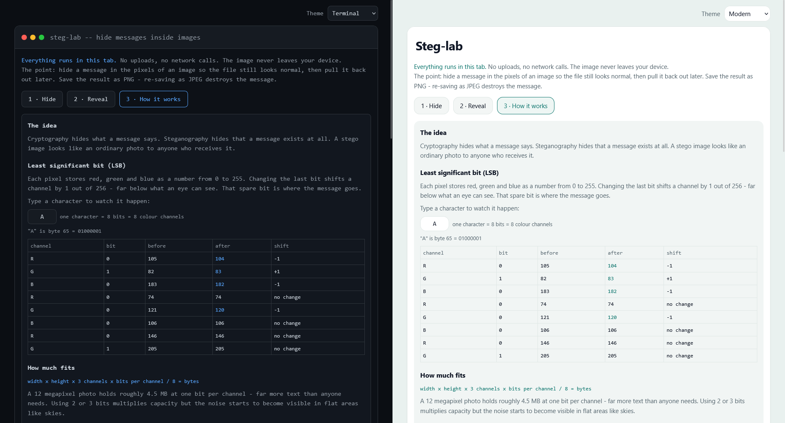

# steg-lab

A single-file, client-side tool for learning how steganography actually works. Hide a message in the pixels of an image, share the PNG, pull the message back out. Nothing is uploaded and there are no network calls - the whole thing is one HTML file.

Built as a teaching tool. It shows you the bit planes, the capacity maths and the ways hidden messages get caught, rather than just handing you an image and saying "done".


## Features

- **LSB embedding** at 1, 2 or 3 bits per colour channel, with live capacity calculation as you type
- **Three placement modes** - sequential, scattered (PBKDF2-derived position sequence), or hardened (see below)
- **Hardened mode** - LSB matching instead of replacement, keyed scatter placement, and no plaintext header; without the passphrase there is no signature to find and a wrong passphrase is indistinguishable from an image with nothing hidden
- **AES-GCM encryption** (PBKDF2-SHA256, 150k iterations) applied before embedding when a passphrase is set; mandatory in hardened mode with two independent 256-bit keys
- **Bit-plane viewer** showing the lowest bit before and after, so you can see what embedding does to an image
- **Auto-detecting decoder** - tries hardened first (AES-GCM tag validation), then standard header detection; the recipient only needs the passphrase
- **Two themes** - terminal (dark) by default, modern (light) in the dropdown
- No build step, no dependencies, no tracking. Open the file or drop it on any static host.

## Usage

Open `index.html` in a browser. That is the whole install.

**Hiding:** drop an image, type a message, optionally set a passphrase, click Hide message, download the PNG.

**Revealing:** drop the PNG, enter the passphrase if one was used, click Reveal message.

Serve it from anywhere static if you want it on a URL:

```bash
python3 -m http.server 8000
```


## How it works

Each pixel stores red, green and blue as a value from 0 to 255. Changing the last bit shifts a channel by 1 in 256, which is far below what an eye can see. That spare bit is where the message goes.

Capacity is `width x height x 3 channels x bits per channel / 8` bytes, minus a 9-byte header. A 12 megapixel photo holds roughly 4.5 MB at one bit per channel.

### Format

A 9-byte header is written sequentially from the first channel:

| Bytes | Field |
| --- | --- |
| 0-3 | magic `STG1` |
| 4 | flags - bits 0-1 hold the bit depth, bit 2 scattered, bit 3 encrypted |
| 5-8 | payload length, big endian uint32 |

The payload follows, either sequentially or at scattered positions whose gaps come from a 128-bit seed derived from the passphrase (PBKDF2-SHA256, 150k iterations, fixed salt - the reader has to locate the payload before it can read a stored salt).

**Hardened format** has no header. Layout in the opaque-channel slot space: a 16-byte PBKDF2 salt in slots 0-127, an AES-GCM-encrypted 4-byte length in slots 128-383, and the AES-GCM-encrypted payload scattered across slots 384+. One PBKDF2 derivation (640 bits) from pass + salt produces the scatter seed and two independent AES-256-GCM keys (one for the length block, one for the payload). Salt and length live at fixed positions so they always read back after LSB matching perturbs the image; the payload scatter count is recoverable from the decrypted length, so its positions are reproducible. The decoder validates by AES-GCM authentication tag rather than a magic string. All writes use LSB matching (nudge ±1) rather than replacement. When encryption is on, the payload is `salt(16) || iv(12) || AES-GCM ciphertext+tag`.

The decoder tries bit depths 1 to 3 and checks the magic, so nothing has to be remembered except the passphrase.


## Limitations and threat model

Worth reading before you rely on this for anything.

- **The header is a signature.** It is always sequential and unencrypted. That is what makes decoding effortless, and it also means the tool announces itself to anyone who greps for `STG1`. Real covert channels do not include a magic string.
- **Scattering hides shape, not contents.** Positions are stretched from the passphrase with PBKDF2, so guessing them costs the same work as guessing the key, but the scattering is there to stop the embedded data looking like a block. Confidentiality comes from the AES-GCM layer underneath.
- **Hiding is not protecting.** Without a passphrase, anyone who guesses the method reads the message.
- **PNG only on output.** JPEG discards exactly the bits the message lives in. You can load a JPEG as a carrier, but the result must be saved as PNG. Anything that re-compresses the image - most messaging apps and social platforms - destroys the message. Send the PNG as a file attachment.
- **LSB is detectable in standard mode.** Bit-plane inspection, chi-square and RS analysis pick up LSB replacement. Hardened mode uses LSB matching (nudge ±1 instead of force), which defeats chi-square and RS analysis. Note hardened placement is content-blind - it scatters by a keyed seed rather than steering bits into busy regions, so a determined local-variance analysis of smooth areas is still a theoretical avenue. A diff against the original works regardless of mode.
- **Transparent pixels are skipped.** Canvas premultiplies alpha, so RGB in semi-transparent pixels is not reliably preserved across a load and save. Capacity drops accordingly and the UI says so.
- **Browsers with canvas fingerprinting protection** (Brave shields, Firefox `resistFingerprinting`) add noise to pixel reads and will corrupt messages in both directions. Turn protection off for the page or use a different browser.
- Re-encoding through canvas strips EXIF from the carrier, which is a useful side effect but not a substitute for deliberate metadata scrubbing.
- **Hardened mode requires ~150+ opaque pixels** for any capacity, due to the fixed 384-slot (128-pixel) overhead for the salt and length zones. Any real photograph is far above this.

This is a tool for understanding the technique. Hardened mode closes the most common detection vectors (chi-square, RS analysis, bit-plane inspection, grep-for-magic) but is not a substitute for proper operational security.

## Browser support

Needs `crypto.subtle` (so a secure context - `https://` or `localhost`), canvas, and `TextEncoder`. Any current Chrome, Firefox, Safari or Edge is fine. Opening the file directly with `file://` works in Chrome and Firefox for everything except passphrase mode, which needs the secure context.



## License

MIT. Copyright (c) Shane McElhinney.
